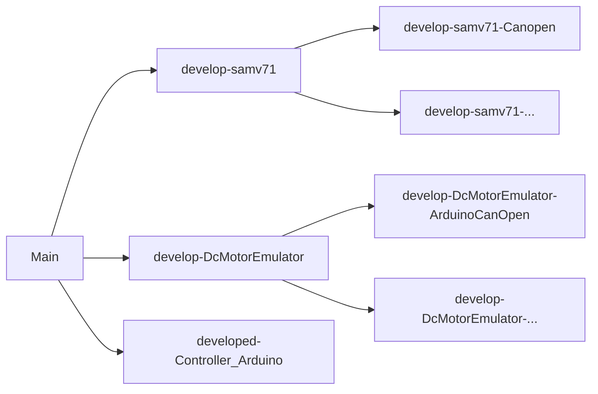

This is the repository for software and firmware development of the Roverito project  https://github.com/spacebee-technologies/rovertito/blob/develop/README.md

Repository organization chart:

```mermaid
flowchart LR
    A[Main]-->AA[develop-samv71];
      AA[develop-samv71]-->AAA[develop-samv71-Canopen];
      AA[develop-samv71]-->AAB[develop-samv71-...];
    A[Main]-->AB[develop-DcMotorEmulator];
      AB[develop-DcMotorEmulator]-->ABA[develop-DcMotorEmulator-ArduinoCanOpen];
      AB[develop-DcMotorEmulator]-->ABB[develop-DcMotorEmulator-...];
    A[Main]-->AC[developed-Controller_Arduino];
    
    click AA href "https://github.com/spacebee-technologies/Rover-Testing/tree/develop-samv71"
    click AAA href "https://github.com/spacebee-technologies/Rover-Testing/tree/develop-samv71-Canopen"
    click AB href "https://github.com/spacebee-technologies/Rover-Testing/tree/develop-DcMotorEmulator"
    click ABA href "https://github.com/spacebee-technologies/Rover-Testing/tree/develop-DcMotorEmulator-ArduinoCanOpen"
    click AC href "https://github.com/spacebee-technologies/Rover-Testing/tree/Developed-Controller_Arduino"
```
